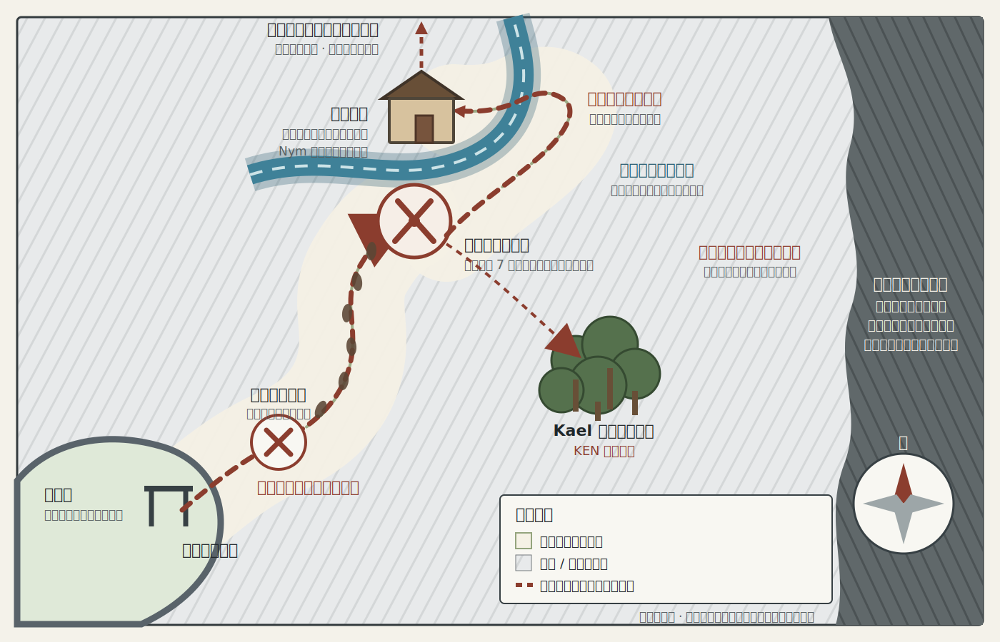
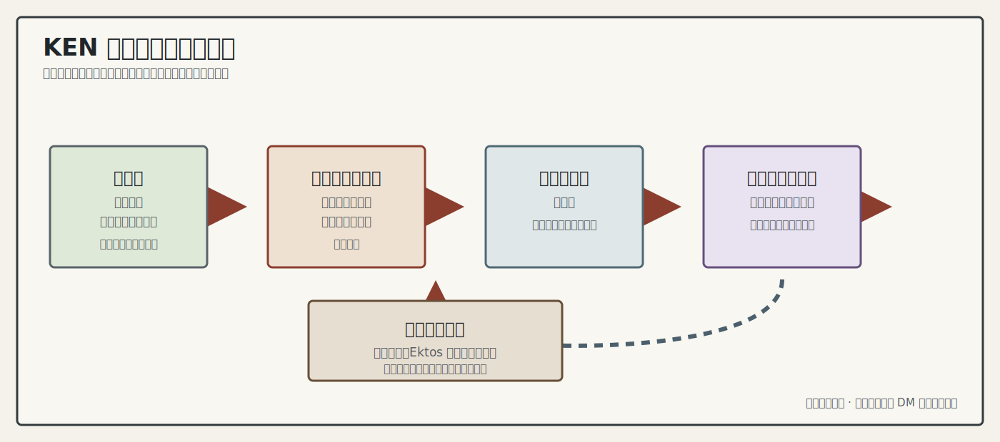

# KEN 小队第一章探索地图

这些地图只记录角色当前知道的地理信息，不是 DM 全知地图。位置和路线按游戏中的口述信息绘制；未经测量的距离、边界和地形均为示意。KEN 第一章已在诸神试验场暂停，神源镇与城外地图保留为第一章前期已确认的探索记录。

## 神源镇探索地图

已确认的信息：

- 神源镇约数公里方圆。
- 厄拉西斯神殿位于神源镇中心，是此前所称的中心教堂。
- 第一晚的旅馆在厄拉西斯神殿以东约 500 米。
- 从旅馆前往厄拉西斯神殿会经过集市。
- 神源镇有城墙，东北出口是正式城门。
- 第 1 天晚上侦测到的疑似导师相关魔法痕迹指向神源镇东北方向。
- 神源镇东方最近刚发生过一次与黑潮有关的战斗。
- 东方的近期黑潮战场与东北方向的导师线索不是同一地点。

## 东北城门外追踪地图

已确认的信息：

- 小队根据东北方向的疑似导师相关线索从正式东北城门出发，先向东北走了一小段。
- 小队随后发现战斗痕迹和可追踪的脚印。
- 脚印转向北方；小队沿脚印向北曲折前进约数公里。
- 路线最终抵达发生僵尸战斗的河流附近。
- 小队在河边先击败 6 只僵尸，随后追上 1 只曾经逃脱的僵尸，累计击败 7 只；Kael 找到的小树林被用作临时营地。
- 河流在战斗地点之后转向北方；小队沿河向北行进一段，随后渡河抵达森林小屋。
- 小队在森林小屋击败噬脑怪并获得 3 个黑水晶；二楼发现托比厄斯留下的星象盘。
- 小队在森林小屋遇到托比厄斯雇佣的护卫；一名临终护卫说明托比厄斯在袭击后逃往小屋北方的观测站旧址。小队后来抵达旧址并救出托比厄斯；小屋至旧址的精确距离、路线和沿途地形仍未测绘。
- 森林小屋战斗与调查结束后，Nym 在此完成一次短休并使用奥术回复恢复 1 个 2 环法术位，随后小队返回神源镇。
- 尚未证实脚印、导师线索与东方黑潮战场三者之间存在关联。

## 第一章终章跨界路线图

这是一张事件与移动顺序图，不表示神源镇、冻结迷雾区、诸神试验场和铁血营寨之间的实际地理距离或方位。

已确认的信息：

- 小队返城路上见到空间裂痕；托比厄斯·星眠要了一匹马返回灯塔城。
- 神源镇内发生城墙、城中与神殿周边的连续战斗；此前地图并未测绘这些战斗的精确位置与破坏范围。
- 马特发动传送法阵后，小队经过冻结迷雾区，到达诸神试验场边界并目睹灭世魔法流星爆。
- 众人在铁血营寨大厅醒来。该处与试验场边界的相对位置、营寨布局及回归路径尚未探明。

## 图面约定

- 清晰标注的地点：已经到访或由可靠信息确认。
- 虚线和“约”字：方向或距离已知，但没有精确测绘。
- 斜线阴影：尚未探明，不能据此判断道路、建筑、敌人或地形。
- 近期黑潮战场：位于神源镇东方，与东北方向的导师线索分开；城外图用贯穿东侧的阴影带表示“只确定东方”，并不代表战场实际覆盖整个东部，其南北边界和遗留危险仍未知。

## 后续可确认

- 第一晚旅馆的名称。
- 城墙的精确形状、其他城门的位置及守卫部署。
- 战斗痕迹距离神源镇多远，以及向北追踪路线的精确曲折与距离。
- 河流名称、整体流向、小队从哪一侧渡河，以及森林小屋的精确位置。
- 森林小屋到北方观测站旧址的精确距离、路线与沿途地形。
- 东部黑潮战区与河流、当前路线之间的相对位置。
- 冻结迷雾区、诸神试验场边界与铁血营寨的实际空间关系，以及回到原世界的路径。
