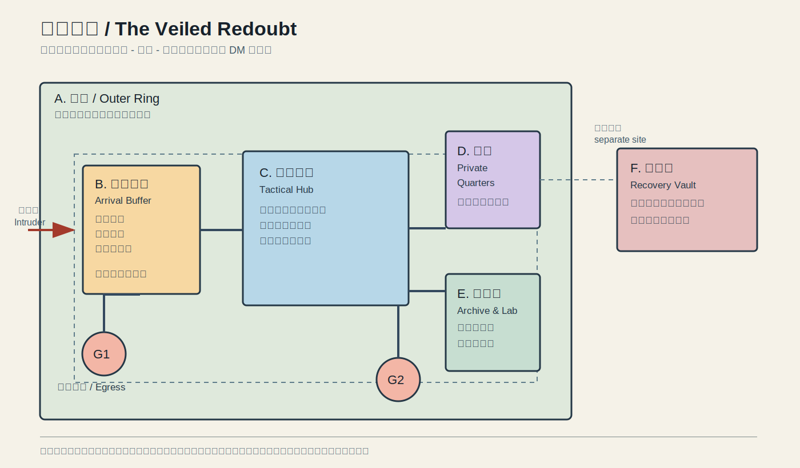

# 暮幕壁垒基地预案

> **状态：设计草案。** 这不是已经存在的据点，也不假定所有设施能在开团前完成。地图只表达固定基地的功能分区，具体尺寸、地形、材料、人员与法术持续时间由 DM 确认。低价施法材料与后 20 级成长采用已确认的 [新团团桌规则](rulings.md)。

## 使用原则

- **先发现，再拖延，最后撤离。** 警报术、魔法嘴、守卫武器与忠实猎犬先争取一轮信息与行动，而不是承诺挡住所有入侵者。
- **睡眠区不与外层相邻。** 瑟伦的私人空间位于内层；其内的 J 安全室有两条不经过主门的逃离路线，同伴可在各自房间保留独立出口。
- **法术书、克隆容器与关键材料分散。** 不让单一刺客、一次传送或一次反魔法效应同时夺走全部恢复手段。
- **传送区与核心资料隔离。** 传送到达不等同于获准进入；来访者先在接收区接受识别与人工确认。
- **免费材料用于增加层数，而非取代判断。** 单件价值不高于 500 gp 的法术材料均免费，无论是否消耗；适合把守卫刻文、秘法锁、魔法嘴、传送法阵与防护善恶用于更多独立层。它们仍然消耗施法时间、法术位，并受到各自的地点和触发限制。
- **反魔法时仍能运转。** 接收区到内层之间保留实体石墙、普通门闩和至少 25 尺间距的分段缓冲；领域只能压制其中一段的魔法层，不能移除永久的非魔法石墙。

## DM 用空间节点 / DM-Facing Spatial Nodes

> 图上的分区不是抽象概念：下表给出默认可跑团的结构。DM 可按地形把它整体旋转、镜像或缩放；除非特别说明，门均为普通实体门，不能由反魔法消除。

| 节点 | 尺寸与实体结构 | 常驻魔法层 | 入侵者的下一步与小队响应 |
|---|---|---|---|
| A1-A3 外环哨点 | 三个分开的视线点；任一哨点失守不直通主楼 | 警报术、魔法嘴、魔宠巡查 | 报警后观察，不在这里决战；守卫撤往 B1。 |
| B1 外门与检查室 | 外门进入 20 尺检查室；只能向右折 90 度进入 B2 | 警报、秘法锁、守卫刻文的非致命触发优先 | 入侵者不能从门口直接看见中枢；关闭 B2 后由 C 区决定是否反制。 |
| B2 折角缓冲 | 两段各至少 25 尺、彼此不在同一直线的石墙走廊；两道独立实体门 | 守卫结界、魔法嘴、可更换的守卫刻文 | 反魔法领域只能覆盖局部魔法层；入侵者仍须逐门破坏或绕过实体阻塞。 |
| C 战术中枢 | 至少 30 尺见方，有两条横向退路，不能被 B2 一线射穿 | 私人密室、通讯与情报设施 | 默认交战/判断点。若敌人跨入 C，队伍分流至 D/J、E 或 G。 |
| D 寝室外层 | 由永久石墙形成的内层，不与 B 相邻 | 私人密室、警报、魔法嘴 | 只作为苏醒和集结区；不把法术书、克隆和队员全部放在这里。 |
| J 安全室 | D 内的无窗 15 尺方室；两道相隔 25 尺的普通加固门，门之间没有直线通道；一条通往 G2 的实体后路 | 私人密室；若能获得高阶牧师，再加圣居术 | 突袭时带走当日法术书分卷和通讯物，锁门后走 G2；它用于争取撤离时间，不是困守到底的地堡。 |
| E 档案与实验室 | 与 D 通过横向走廊相连；至少两只独立锁柜，主书与备用书不共柜 | 私人密室、耐斯图尔的魔法灵光、忠实猎犬 | 档案被突破时不恋战；事先转移到 F 或半位面。 |
| F 复原库 | 与主楼物理分离、地址最小化暴露；外围石墙和普通门闩，不能从 C 直接到达 | 私人密室、灵光伪装；条件允许时禁制术 | 克隆容器和一份备用书分离保存；主楼被攻破不等于复原手段丢失。 |
| G1 / G2 撤离 | G1 为外环公开撤离；G2 为 J 安全室后的隐蔽实体路线 | G1 可有传送支援；G2 不依赖魔法 | G1 已被监视、反魔法或堵塞时固定使用 G2；集合点不设在 F。 |

## 分区与预案

| 区域 | 功能 | 典型布置 | 遇袭时处理 |
|---|---|---|---|
| A. 外环 / Outer Ring | 发现接近者 | 可视哨点、警报术、魔法嘴、巡逻 | 传讯，不独自迎战 |
| B. 接收与缓冲 / Arrival Buffer | 处理传送、陌生访客与战利品 | 可控门禁、非致命阻滞、远离睡眠区 | 关闭通往内层的门，确认身份 |
| C. 战术中枢 / Tactical Hub | 队伍集结、分配资源、查看情报 | 共享地图、通讯、备用焦点 | 由队长判断反击或撤离 |
| D. 私人寝室 / Private Quarters | 长休、法术书与个人物品 | 私人结界、警报、近距撤离节点 | 苏醒后优先获取信息和脱离 |
| E. 档案与实验室 / Archive & Lab | 法术书、抄录、研究与鉴定 | 分卷备份、独立锁柜 | 不在这里与入侵者缠斗 |
| F. 复原库 / Recovery Vault | 克隆容器与高价值耗材 | 与主建筑物理分离、少人知晓 | 保持地址与入口最小化暴露 |
| G. 撤离节点 / Egress Nodes | 短距脱离与集合 | 多条预设路线、队友集合点 | 任何一条失效即切换另一条 |
| H. 符文工坊 / Warding Foundry | 制作与重置低价符文层 | 守卫刻文、秘法锁、魔法嘴、警报术；按入口分区而非堆叠在一扇门上 | 先切断或误导入侵路线，再通知中枢 |
| I. 升华与同调室 / Ascension Ward | 胜利后的等级、神格碎片与新同调结算 | 物品同调区、恩惠记录、下一战情报板 | 不在战斗中处理；完成结算后再出发 |
| J. 安全室 / Safe Room | 突袭时让队伍取得一次有序撤离的时间 | 双重实体门、私人密室、通往 G2 的后路 | 锁门、带走当日关键物品、撤离；不与入侵者僵持 |

## 长期施法与实体防线 / Long-Term Magic and Physical Fallback

> 以下均以 DM 确认基地已存在且允许 365 天开团前准备为前提。新团规则免除材料金币，不免除每天的施法时间、法术位和连续天数。

| 设施 / Facility | 规则成本 / Rule Cost | 计划位置与作用 / Placement and Purpose |
|---|---|---|
| 永久传送法阵 / Permanent Teleportation Circle | 同一地点每日施放 365 天；每天 1 个 5 环位；50 gp 墨水免费，因此材料 **0 gp** | B 区接收缓冲。提供已知序列的可靠回归，但接收区本身不与内层相连。 |
| 永久私人密室 / Permanent Private Sanctum | 同一地点每日施放 365 天；每天 1 个 4 环位；铅片材料免费 | C、E、F 区分开布置。阻止传送、位面旅行、侦测和窥视；A 区刻意不覆盖。 |
| 永久守卫结界 / Permanent Guards and Wards | 同一地点每日施放 365 天；每天 1 个 6 环位；10 gp 银棒免费 | B 区。雾、错路、门锁、蛛网与内置效果用于争取时间；效果仍可被逐项解除或被反魔法压制。 |
| 耐斯图尔的魔法灵光 / Nystul's Magic Aura | 同一物件每日施放 30 天；每天 1 个 2 环位；材料免费 | E、F 区中可移动的关键物品和诱饵。使侦测魔法看到假灵光；不阻止真正的反魔法或物理搜查。 |
| 石墙术 / Wall of Stone | 维持专注满 10 分钟；无价格材料 | B 区折角、F 区外围和备用撤离路。形成永久、非魔法的石墙与掩体，是反魔法时仍可靠的结构。 |
| 圣居术 / Hallow | 24 小时、1 个 5 环位、1,000 gp 材料；直到被解除 | J 安全室优先。瑟伦不能自行施放，须聘请或获得高阶牧师；已预留材料但尚未假定结界存在。 |
| 禁制术 / Forbiddance | 连续 30 天施放后永久；每天 1 个 6 环位，最终施放消耗 1,000 gp 红宝石粉 | F 复原库优先，其次为 J。封锁位面旅行与传送的方向性风险；同样须由高阶牧师完成，已预留材料但尚未假定结界存在。 |
| 半位面 / Demiplane | 每次 1 小时、1 个 8 环位；开门结束后内容留在该半位面 | 作为 E/F 的**离线档案库**，存放非当日使用的书卷和备份；不是遭遇中可靠安全室，因为必须先在领域外开门。 |
| 拟像术准备席 / Simulacrum Preparation Bay | 12 小时、1 个 7 环位、1,500 gp 红宝石粉 | E 区。已在开团前完成；本体随后长休，拟像不承担会耗尽后无法恢复的日常法术位消耗。 |

### 反魔法响应 / Antimagic Response

1. 发现敌方施法时，领域外的瑟伦优先以低预兆配合反制法术阻止其完成。
2. 若领域已出现，所有人沿实体路标撤向下一段缓冲区；不要在领域内尝试传送、力场囚笼、护盾术或启动魔法物品。
3. 保持各层关键门与魔法节点至少相距 25 尺；领域跟随者必须在普通门、永久石墙与队友的非魔法攻击之间逐段推进。
4. 已知威胁、且仍在领域外时，可由瑟伦在 B2 或 C 的固定折角施放虹光法墙。它只用于分割、拖延或强迫绕路，不替代实体工事，也不作为未知敌人的默认 9 环准备。

### 安全室与永久安全的边界 / Safe Room and Permanent Safety Boundaries

- **没有法师单独施放的永久 7 环“绝对安全屋”。** 宏伟宅邸持续 24 小时；虹光法墙持续 10 分钟；它们都很强，但都不是固定基地的长期核心。
- 对瑟伦而言，最接近长期安全壳的是：永久私人密室 + 永久守卫结界 + 永久石墙 + 实体门闩；这些组成 J 的日常层。它们会被解除、绕开或在反魔法中压制，故仍必须有 G2。
- **半位面**适合让关键备份不与主楼同址，但不能当作“按一下就躲进去”的战斗避难所：开门本身需要 8 环施法，且反魔法内无法使用。
- 若能获得高阶牧师，**圣居术**给 J 额外的长期区域效果，**禁制术**给 F/J 长期的传送与位面渗透限制。这两项是最有价值的永久补强，但不应误记成瑟伦当前已有能力。

## 资源分层 / Resource Tiers

| 层级 | 可反复布置 | 仍需慎用 |
|---|---|---|
| 免费低价材料 | 守卫刻文 / Glyph of Warding、秘法锁 / Arcane Lock、魔法嘴 / Magic Mouth、防护善恶 / Protection from Evil and Good、魔法阵 / Magic Circle、传送法阵 / Teleportation Circle、寻获魔宠 / Find Familiar、真知术 / True Seeing、鉴定术 / Identify、宏伟宅邸 / Magnificent Mansion | 单件材料不高于 500 gp 即免费；每次仍花费施法时间与法术位，守卫刻文不能随意搬离其施放地点 |
| 高价材料与实体工程 | 触发术雕像、克隆容器、备用法术书、永久石墙与普通门闩 | 力场囚笼红宝石粉、徽记术材料、拟像术材料、克隆术钻石；只为决定性局面支付 |

## 胜利后循环 / Victory Loop

1. 返回基地并确认是否有追踪、传送或反魔法威胁。
2. 完成长休或必要短休，补齐符文工坊中消耗的低价防护。
3. 结算一个后 20 级成长：法师准备位 +1，选择一个兼职等级，并更新生命、能力与物品训练。
4. 若获得神格碎片：选择一个传奇恩惠、同调上限 +1，并把新同调物品写入角色卡。
5. 将下一名主要敌人的 CR 记为上一名 +2；根据已知伤害类型、隐形、施法或群体特征更换准备法术。

## 每次长休前检查

- 确认警报与门禁的范围、口令和例外对象。
- 检查法术书分卷、传送头盔、关键耗材和通讯工具是否在预定位置。
- 检查符文工坊的守卫刻文、秘法锁与魔法嘴是否仍覆盖正确的分区；不把所有触发效果集中在同一扇门。
- 明确当夜守望顺序、叫醒信号与至少两个集合点。
- 若已获得敌方传送或反魔法情报，先由 DM 确认现有布置是否仍有意义，再决定是否调整法术准备。
